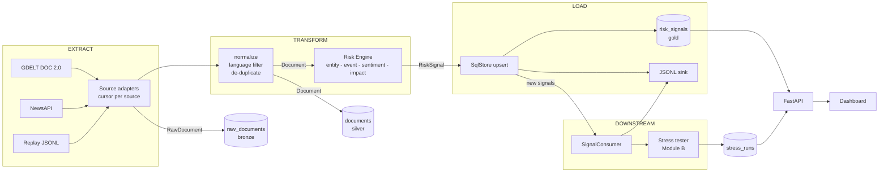

# Architecture

PRISM reads unstructured financial text, turns it into structured risk signals, and acts on them.
Three rules keep it modular:

1. **One data vocabulary.** Everything that crosses a boundary is a model from `prism/core/contracts.py`.
2. **Every pluggable part is a protocol** (`prism/core/interfaces.py`): a source, a sentiment model, an event
   classifier, an entity linker, an impact model, a store, a downstream consumer.
3. **One composition root** (`prism/bootstrap.py`) is the only code that knows which implementation fills which slot.
   It is driven by settings, so swapping a backend is a config change.

## Data flow



## Layers and the dependency rule

| Package | Responsibility | May import |
|---|---|---|
| `prism.core` | contracts, protocols, event taxonomy, ids, errors | nothing from prism |
| `prism.etl` | extract adapters, transform steps, pipeline, scheduler, JSONL sink | `core` |
| `prism.nlp` | the Risk Engine and its components | `core` |
| `prism.storage` | SQLAlchemy models and `SqlStore` | `core` |
| `prism.modules` | downstream decision modules (today: `stress`) | `core` |
| `prism.api`, `bootstrap`, `cli`, `config` | composition root and entry points | everything |

`backend/tests/test_architecture.py` parses the imports and fails the build if a layer reaches past this table.
That is what makes "modules never see the ETL or the NLP engine" a checked property rather than a promise.

## Data layers (medallion)

| Layer | Shape | Table | Purpose |
|---|---|---|---|
| bronze | `RawDocument` | `raw_documents` | exactly what the provider returned (replayable) |
| silver | `Document` | `documents` | cleaned, language-filtered, de-duplicated text |
| gold | `RiskSignal` | `risk_signals` | the structured output everyone consumes |
| ops | | `etl_runs`, `etl_rejects`, `kv_state` | per-run report, rejected records with reasons, source cursors and quotas |
| module | | `stress_runs` | stress results (stored as plain JSON, so storage does not import the module) |

## ETL semantics

- **Incremental.** Each source owns an opaque cursor (GDELT/NewsAPI: newest timestamp, replay: line offset) kept in `kv_state`.
  Cursors advance only after a successful load.
- **Idempotent.** Document ids, signal ids and content hashes are deterministic; re-reading a window loads nothing twice.
  Near-duplicates that were merged away are remembered (`merged_hashes`), because GDELT-style overlapping windows
  re-deliver them.
- **Failure-isolated.** A source that is rate-limited or crashes is skipped and reported; a poison document is rejected with a
  reason after a per-document retry; a failing consumer is logged. None of them stop the run.
- **Cross-source de-duplication.** Duplicates are not just dropped: the number of distinct outlets becomes
  `Document.corroboration`, which feeds the impact score.
- **Observable.** Every run stores a report (per-source fetched/rejected/error, duplicates, loaded counts, per-stage seconds).
- **Live vs replay.** `PollingScheduler` polls each enabled source at its own interval (`SCHEDULER_ENABLED=true`);
  the `replay` source streams a JSONL file a few records at a time for a deterministic demo.

## The signal contract

```json
{
  "id": "562192a0217a22da",
  "source": "replay",
  "timestamp": "2026-10-04T18:44:03Z",
  "entity": "Tesla", "ticker": "TSLA", "sector": "Consumer Discretionary", "scope": "company",
  "sentiment_score": -0.6667,
  "event_type": "Regulatory",
  "impact_score": 7.27,
  "confidence": 0.8581,
  "headline": "Tesla shares fall after regulators open an investigation ...",
  "explanation": {
    "impact_points": {"severity": 2.52, "sentiment_magnitude": 1.5, "exposure": 1.8, "source_reliability": 0.45, "corroboration": 0.0},
    "event_top3": [{"event": "Regulatory", "p": 1.0}],
    "models": {"sentiment": "lexicon", "event": "rules", "impact": "weighted-v1"}
  }
}
```

`scope` is `company` (a tracked ticker), `market` (no tracked entity but a recognisable event) or `sector`.
Text with neither an entity nor an event is dropped as irrelevant (counted as `skipped_irrelevant`).

## Extension points

| To add... | Implement | Register |
|---|---|---|
| a data source | `Source.fetch(cursor, limit) -> FetchResult` in `etl/extract/` | `build_sources` in `bootstrap.py` (+ `config/sources.yaml`) |
| a sentiment model | `SentimentModel.predict(texts)` in `nlp/sentiment/` | `build_sentiment` + `SENTIMENT_BACKEND` literal in `config.py` |
| an event classifier | `EventClassifier.classify(texts)` in `nlp/events/` | `build_events` + `EVENT_BACKEND` |
| a better entity linker (e.g. spaCy NER) | `EntityLinker.link(text)` in `nlp/entities/` | `build_engine` |
| a downstream module (e.g. Module A, the index rebalancer) | `SignalConsumer.on_signals(signals)` in `modules/<name>/` | `build_container` consumers list |
| a different database | `PipelineStore` protocol + the read methods the API uses | `build_container` |

## Configuration

| File (`backend/config/`) | Controls |
|---|---|
| `companies.yaml` | tracked entities, aliases, sectors, ambiguous names |
| `event_rules.yaml` | regex cues per event type (strong / weak) |
| `event_prototypes.yaml` | prototype sentences for the embedding classifier |
| `impact.yaml` | impact weights, severity priors, exposure, source reliability |
| `scenarios.yaml` | event type -> shock, and the trigger thresholds |
| `portfolio.yaml` | the synthetic wholesale book and its sensitivities |
| `sources.yaml` | GDELT queries, NewsAPI query, replay file |

Environment variables are listed in `.env.example`.

## HTTP API

| Method and path | Purpose |
|---|---|
| `GET /health` | active components and sources |
| `GET /api/risk-signals` | filter by `symbol`, `event_type`, `source`, `min_impact`, `min_confidence`, `since`; paginate |
| `GET /api/risk-signals/latest?symbol=TSLA` | most recent signal (optionally per ticker) |
| `GET /api/risk-signals/{id}` | one signal with its explanation |
| `POST /api/analyze` | run the engine on arbitrary text (`persist` optional) |
| `GET /api/news`, `GET /api/stats` | cleaned documents; dashboard KPIs |
| `POST /api/pipeline/run`, `GET /api/pipeline/runs`, `GET /api/pipeline/rejects` | trigger an ETL run; run reports; rejected records |
| `GET /api/portfolio`, `GET /api/scenarios` | the book and the shock matrix |
| `POST /api/stress-test`, `GET /api/stress-runs` | on-demand what-if; stored runs (auto-triggered ones included) |

## Not built yet

Dashboard, Module A, FinBERT/embedding evaluation, impact calibration, transaction-derived portfolio builder,
semantic de-duplication, hosted deployment. See `docs/roadmap.md`.
